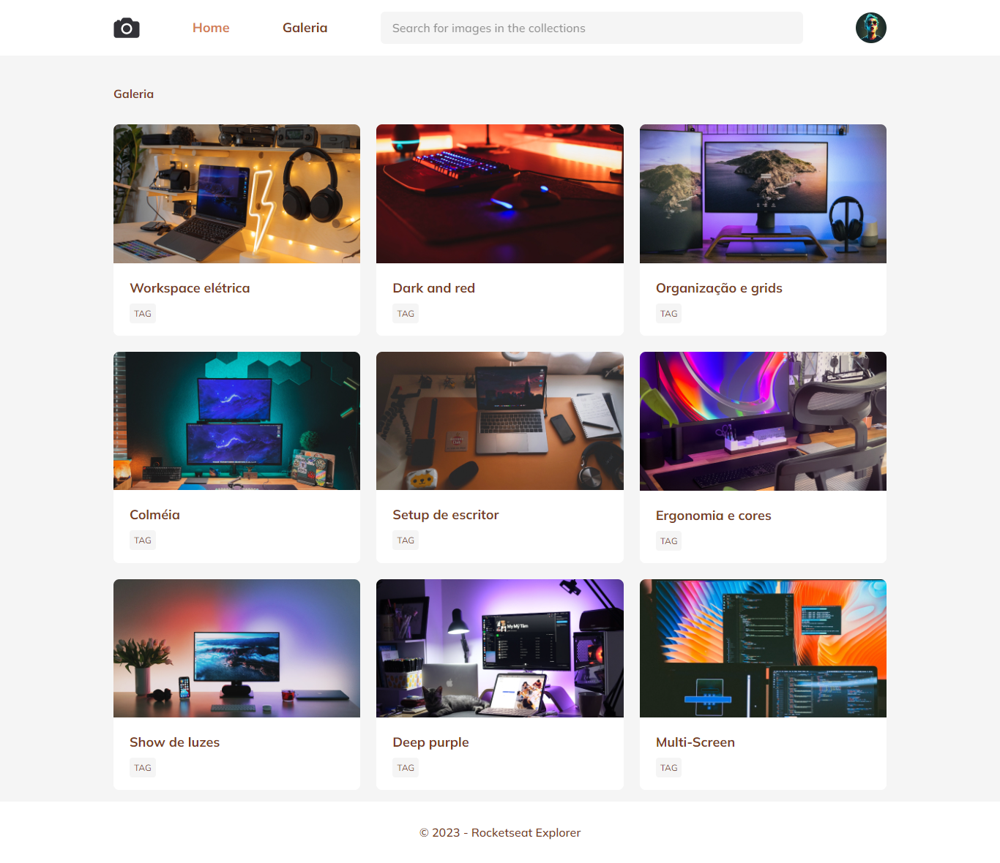

# Photo Blog
 Stage 3 project to improve grid and animation with css.

## Learning

Project aimed at enhancing the concepts of grid and animations in CSS, which are highly advanced techniques designed to improve our lives as developers..

## Used Stack

- Html;
- Css.

## 🔗 Links

